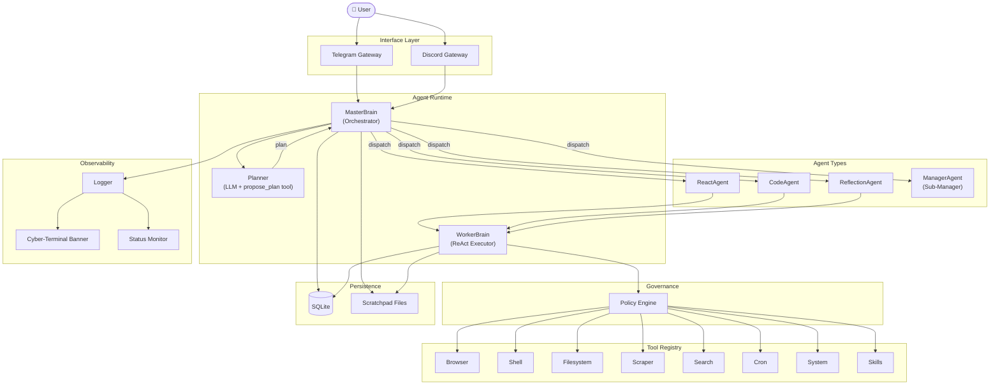

# Mishri Architecture

## System Overview



## Normal Task Flow

```
User: "Search for trending AI tools"

  ┌──────────────┐
  │   Gateway    │  Telegram / Discord receives message
  └──────┬───────┘
         ▼
  ┌──────────────┐
  │ MasterBrain  │  Calls LLM with planner prompt
  │   .Think()   │  LLM returns propose_plan tool call
  └──────┬───────┘
         ▼
  ┌──────────────┐
  │   Planner    │  propose_plan → AgentPlan { agents: [...] }
  │   .plan()    │
  └──────┬───────┘
         ▼
  ┌──────────────┐
  │  Dispatcher  │  Routes to ReactAgent / CodeAgent / ReflectionAgent
  │ .Dispatch()  │
  └──────┬───────┘
         ▼
  ┌──────────────┐
  │ WorkerBrain  │  ReAct loop: Reason → Tool Call → Observe → Repeat
  │   .Think()   │  Uses policy engine before each tool execution
  └──────┬───────┘
         ▼
  ┌──────────────┐
  │    Tools     │  browser, shell, filesystem, search, etc.
  └──────┬───────┘
         ▼
  ┌──────────────┐
  │   Response   │  Report flows back: Worker → Master → Gateway → User
  └──────────────┘
```

## Hierarchical Team Flow

```
User: "Create a team to find a product and sell it online"

  ┌──────────────┐
  │ MasterBrain  │  Planner produces: type="manager", goal="..."
  └──────┬───────┘
         ▼
  ┌──────────────────────────────────────────────┐
  │              ManagerAgent (Sub-Manager)       │
  │  Own workspace: sub_<chatID>_<agentID>        │
  │                                               │
  │  ┌────────────┐    ┌────────────────────┐    │
  │  │ Researcher │───►│ 10 product ideas   │    │
  │  │ (react)    │    └────────┬───────────┘    │
  │  └────────────┘             │                 │
  │                             ▼                 │
  │              ┌──────────────────────┐         │
  │              │ 🔺 ESCALATE          │         │
  │              │ "Which product?"     │         │
  │              └──────────┬───────────┘         │
  └─────────────────────────┼─────────────────────┘
                            │
        ┌───────────────────▼──────────────────┐
        │  Save state to SQLite → Return to     │
        │  MasterBrain → Ask user via Gateway   │
        └───────────────────┬──────────────────┘
                            │
                     User: "Product 3"
                            │
        ┌───────────────────▼──────────────────┐
        │  MasterBrain → Resume ManagerAgent    │
        │  Load state from SQLite               │
        └───────────────────┬──────────────────┘
                            │
  ┌─────────────────────────▼─────────────────────┐
  │              ManagerAgent (resumed)            │
  │                                                │
  │  ┌──────────────┐    ┌──────────────────┐     │
  │  │ Web Developer │───►│ Website built    │     │
  │  │ (code)        │    └──────────────────┘     │
  │  └──────────────┘                              │
  │                                                │
  │  Final report → MasterBrain → User             │
  └────────────────────────────────────────────────┘
```

## File Map

```
mishri/
├── cmd/mishri/
│   └── main.go                  # Entry point, wires everything together
│
├── internal/
│   ├── agent/
│   │   ├── brain.go             # MasterBrain + WorkerBrain + HistoryStore interface
│   │   ├── manager_agent.go     # ManagerAgent (Sub-Manager for team tasks)
│   │   ├── agent_runner.go      # AgentRunner interface + AgentDispatcher
│   │   ├── react_agent.go       # ReAct agent (reason + act loop)
│   │   ├── code_agent.go        # Code agent (write + execute scripts)
│   │   ├── reflection_agent.go  # Reflection agent (draft → critique → revise)
│   │   ├── prompt_manager.go    # Loads prompts from /prompts directory
│   │   └── scheduler.go         # Cron-style task scheduler
│   │
│   ├── gateway/
│   │   ├── gateway.go           # Messenger interface
│   │   ├── telegram.go          # Telegram bot gateway
│   │   └── discord.go           # Discord bot gateway
│   │
│   ├── governance/
│   │   └── policy.go            # Policy engine (regex-based command blocking)
│   │
│   ├── observability/
│   │   ├── logger.go            # Event logger (LLM calls, costs, plans)
│   │   ├── banner.go            # Cyber-Terminal startup banner
│   │   └── status.go            # Live status display (Master/Slave/Idle)
│   │
│   ├── store/
│   │   ├── models.go            # Agent, Plan, Step, EscalationState structs
│   │   └── history.go           # SQLite operations (messages, plans, escalations)
│   │
│   └── tools/
│       ├── tool.go              # Tool interface
│       ├── browser.go           # Headless browser automation
│       ├── shell.go             # Shell command execution
│       ├── filesystem.go        # File read/write/list
│       ├── search.go            # Web search
│       ├── scraper.go           # Web page scraping
│       ├── cron.go              # Scheduled task creation
│       ├── system.go            # System info (CPU, memory, etc.)
│       ├── skill.go             # Dynamic skill loading
│       └── rag.go               # RAG / vector search
│
├── prompts/
│   ├── planner.md               # MasterBrain planning prompt
│   ├── worker_lean.md           # WorkerBrain execution prompt
│   ├── identity.md              # Agent identity
│   ├── soul.md                  # Agent personality
│   └── capabilities.md          # Capability descriptions
│
├── pkg/config/                  # Configuration loading
└── mishri.db                    # SQLite database
```
